# Udacity Nanodegree - Azure Machine Learning Engineer (Project II)

## Project overview
This project was designed to demonstrate MLOps part of the modeling cycle. Three main objectives include: deploying a model, consuming the endpoint of the deployed modeling and creating a pipeline to automate this whole part of MLOps from creating model to deploying model and scoring using that model by consuming the endpoint of deployed model.

Tools used in this project include: Azure Machine Learning module for model training, deploying and creating pipeline, Swagger UI for documentation of the API and Apache Benchmark for testing (benchmarking) the API. The dataset linked [here](https://automlsamplenotebookdata.blob.core.windows.net/automl-sample-notebook-data/bankmarketing_train.csv) was used for this project.

For the first part, i.e. to deploy a model, an AutoML run was established for a classification dataset which included running the dataset through various models. The model with the most accuracy was considered to be the best model. It was a 'Voting Ensemble' model in my case. This model was deployed using the Azure ML UI using ACI container. Logging the activities is an important part in such exercise in order to figure out problems during deployment and consumption. Azure ML provides Application Insights service for this purpose and it was enabled in this deployed model.

Moving to the second part, which is to consume this Endpoint. Azure ML provides with information that can be consumed by swagger and using that a webpage was created that contained documentation of endpoint for the deployed model. This API was tested using Python SDK by posting features to the model endpoint and receiving the output from the API. Benchmarking was also performed to determine the minimum performance of the API.

In the third part, this entire process was automated using Pipeline class in Python SDK for azure. Using a jupyter notebook, an AutoML run was initiated, best model was obtained, endpoint was created and the new data was scored using the model endpoint. A REST endpoint of the Pipeline was created. The entire process was repeated by passing the dataset through this endpoint.

## Architectural diagram
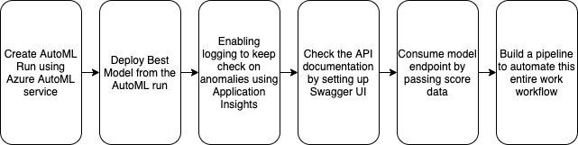

## Key Steps of the project
### Deploy model in Azure ML Studio
#### AutoML run
Registered datasets in ML Studio
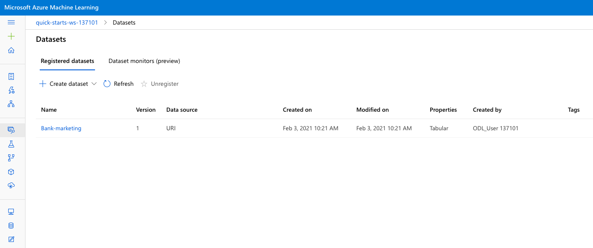
Completed AutoML Run
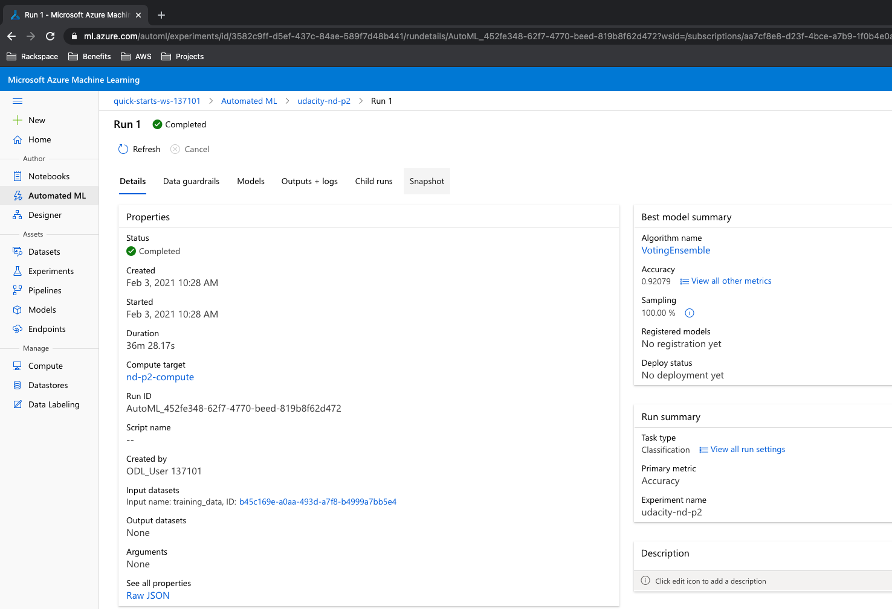

#### Deploy a model and consume the model endpoint
Endpoints in ML Studio, showing that "Application Insights enabled"
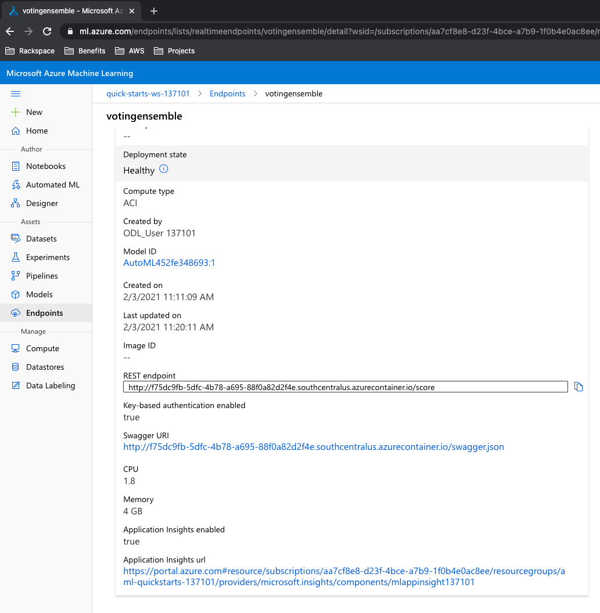

Logging enabled in logs.py script
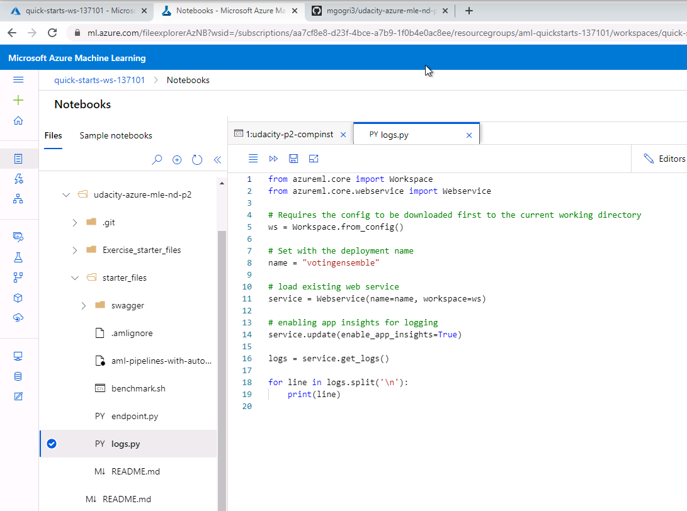
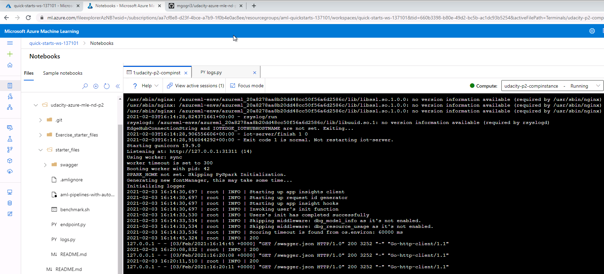

Swagger runs on localhost and responses for the model
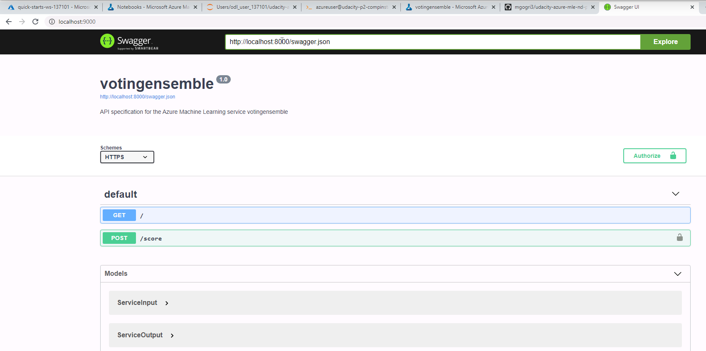
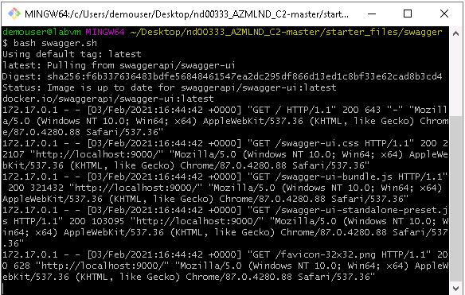

Results by running endpoint.py
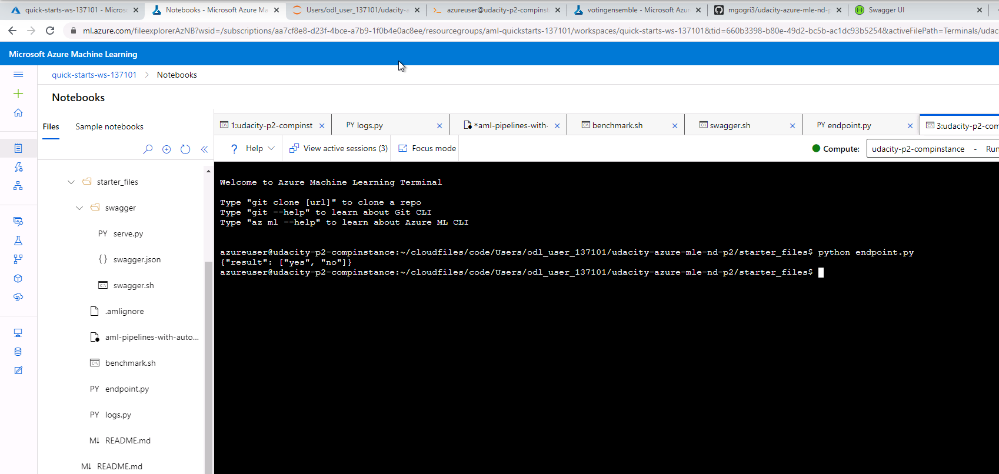

Apache Benchamark runs
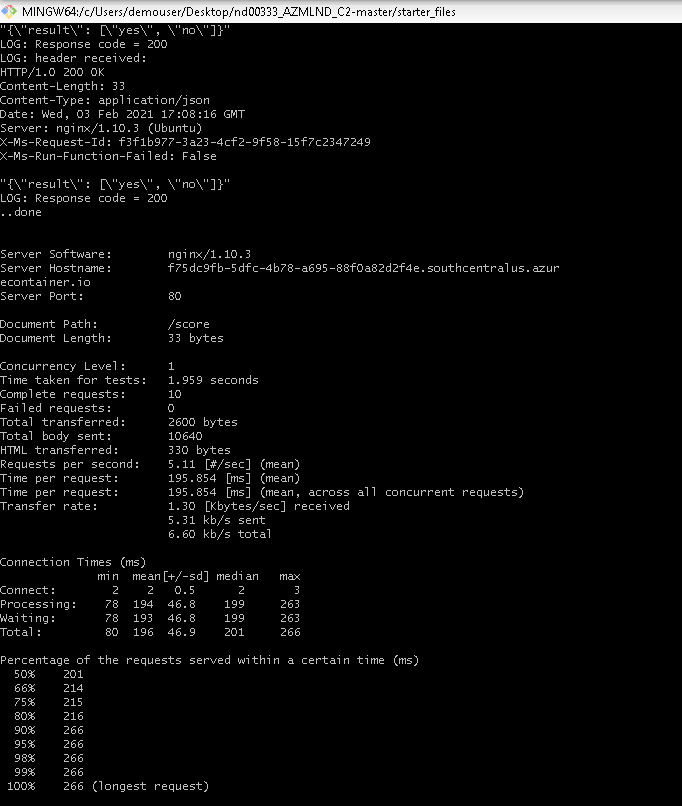

### Publish an ML Pipeline
#### Pipeline created in Azure ML Studio
Pipeline section of Azure ML Studio
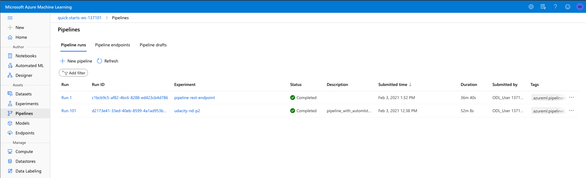

Bank Marketing dataset for AutoML
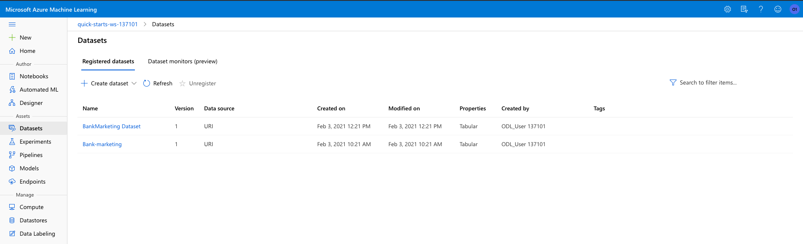

Published Pipeline Overview with Active Status of API
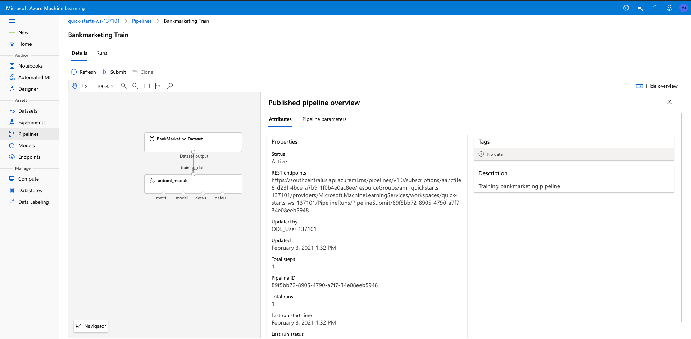

#### Cofiguring Pipeline with Python SDK
Notebook showing RunDetails widget
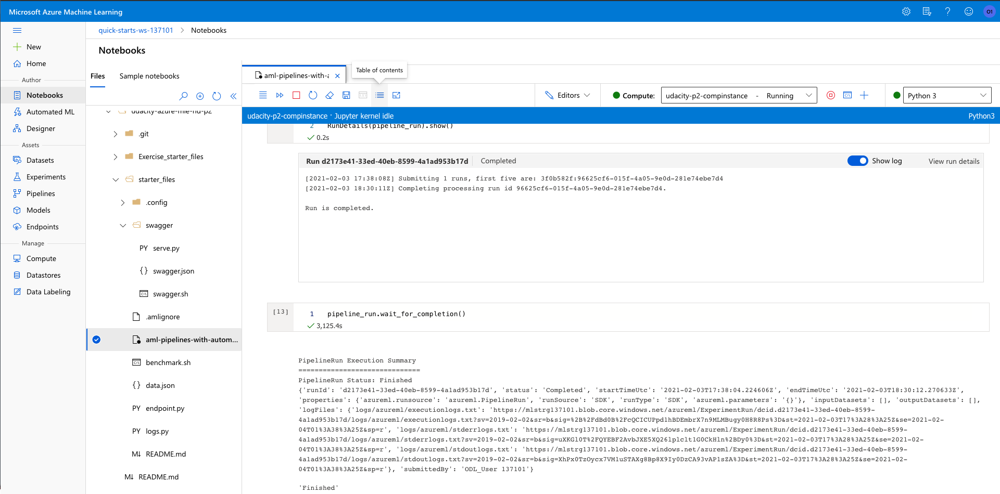

#### Use Endpoint to Interact
ML Studio with pipeline endpoint as Active
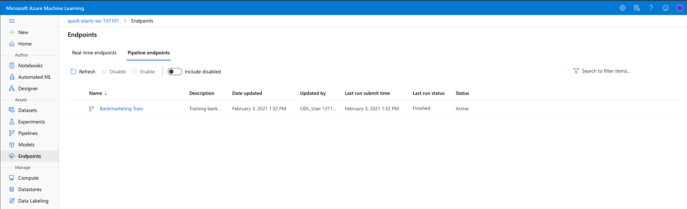

## Scope of improvements for future
Few ways to improve this project:
* Creating endpoints that consider different dataset types like images and audio
* Demonstrating using the API Endpoint for streaming data
* Checking autoscaling of endpoint in case of more demand
* Orchestrating AutoML run more vividly to encapsulate all models rather than terminating based on time

## Project Demo
Link of the screencast for this project: https://youtu.be/3NyVAbX8S9Q
